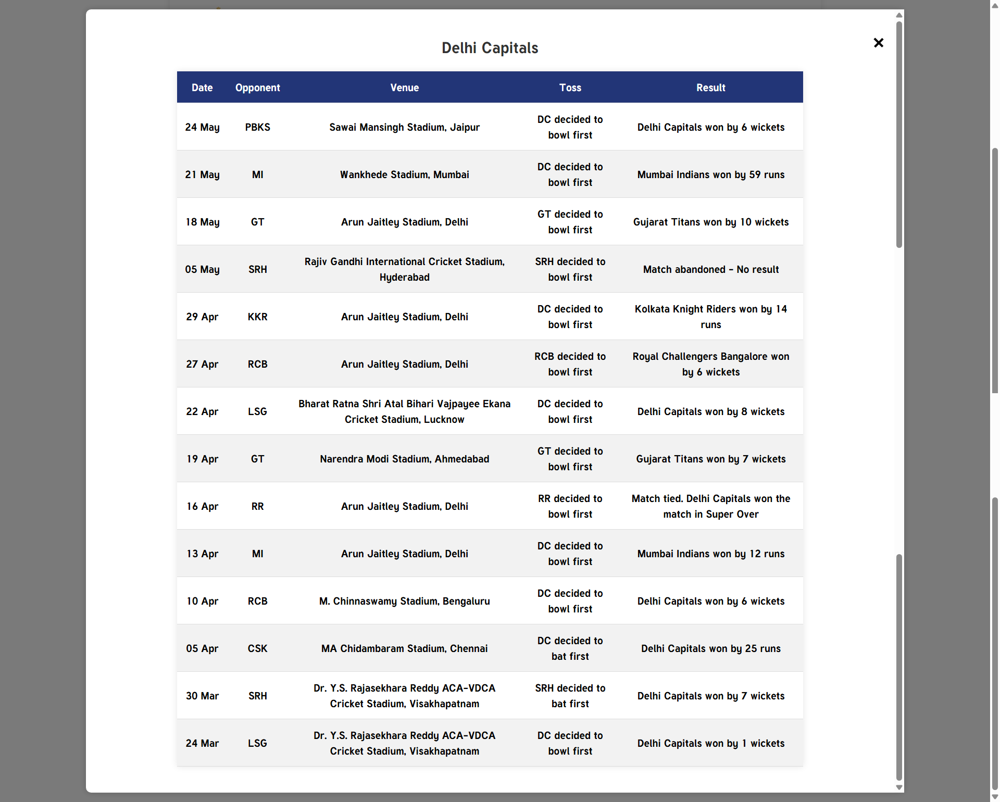
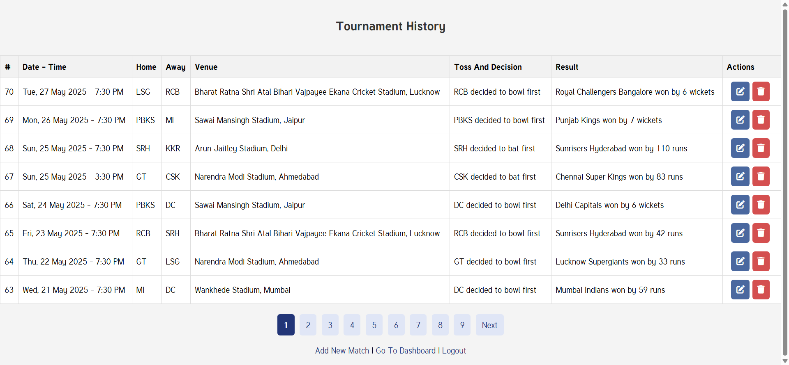
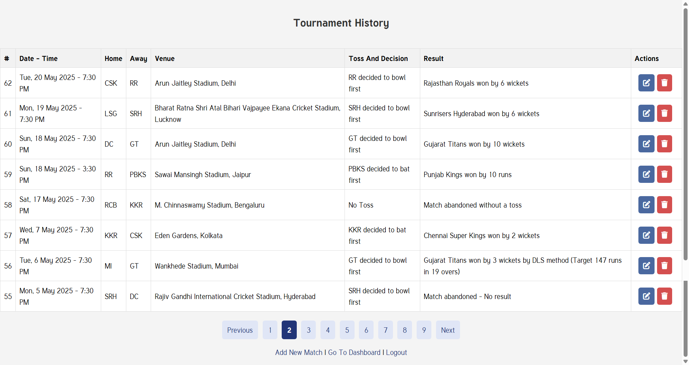
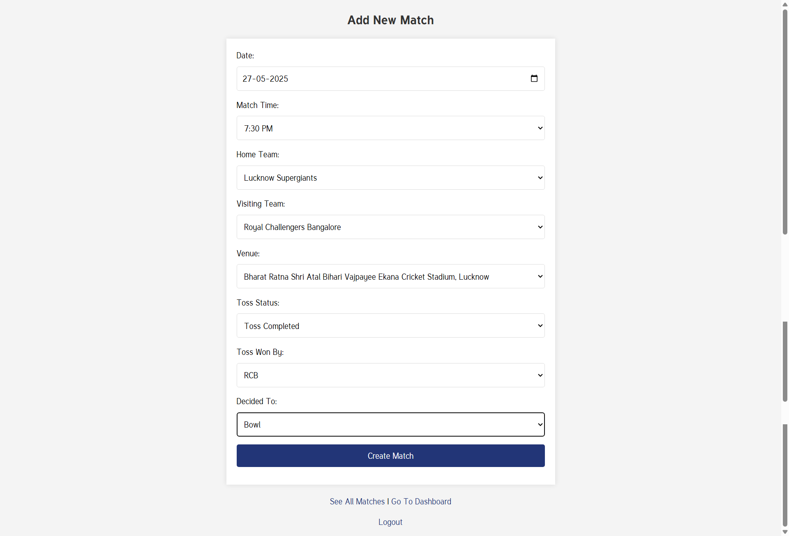
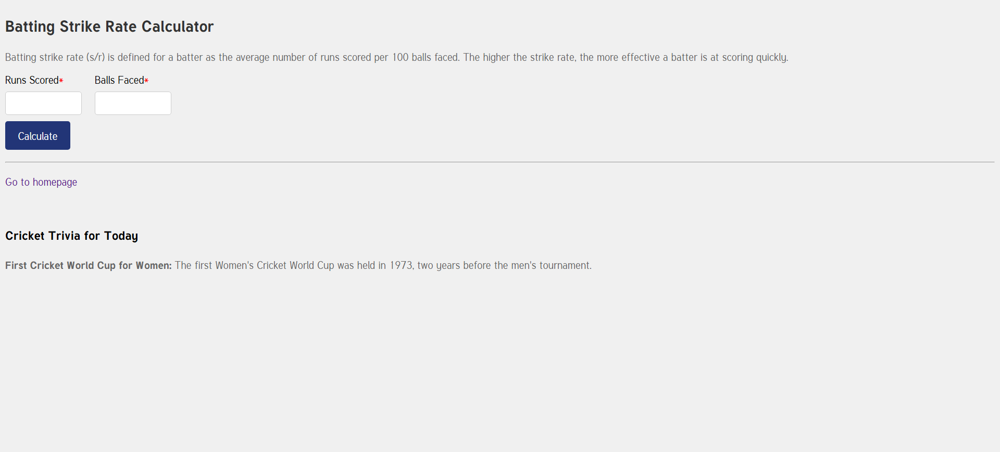
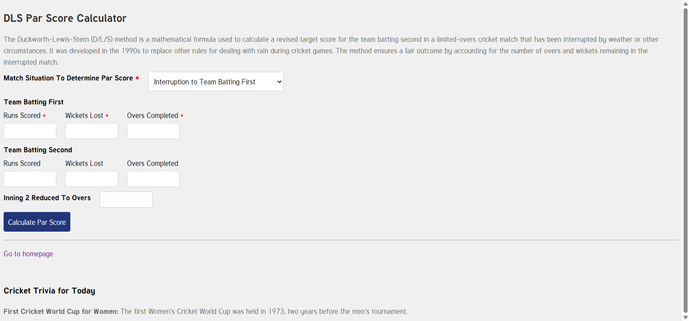

## Cricket Tournament Management System

Easily manage cricket tournament matches and points tables using **PHP** and **MySQL**.
This project is inspired by the **Indian Premier League (IPL)** scorecard system and aims to closely replicate its league-style format. It uses predefined teams, venues, and scheduling to showcase MySQL proficiency, especially in handling dynamic, CRUD-intensive data operations.

Admins can input critical match details such as participating teams, toss outcomes, venue, and Net Run Rate (NRR), allowing the system to generate an accurate and dynamic points table.

Additionally, the system maintains match histories for each team, offering comprehensive insights into team performance throughout the tournament.

---

#### Features

##### User Registration and Authentication

- Only **Super Admin** is authenticated to register new admins.
- User authentication ensures secure access to the system.

##### Admin Privileges

- Admin users have special access rights, including:
  - Creating new matches
  - Deleting existing matches if necessary

##### Password Recovery Feature

- Allows users to reset their forgotten passwords using **PHPMailer**.
- Users receive an email with a unique reset link (valid for 15 minutes).
- Dynamic email content greets users by their registered name.

##### Additional Features

- **Strike Rate Calculator** – Calculates a batsman's strike rate based on runs scored and balls faced.
- **Duckworth Lewis Calculator** – The DLS Calculator is a work-in-progress and may not provide accurate results due to the lack of sufficient real-world data and scenarios. (_under development_).
- **Reduced Overs Match Support** – Admin can mark a match as "Reduced" and specify total overs per side (minimum 5, maximum 19 for T20Is as per ICC) due to weather or interruptions. System adapts ball inputs and logic accordingly.

---

#### Project Information

- Developed with ~2500 lines of PHP backend code
- 50+ Git commits
- Technologies used: PHP, MySQL, HTML, CSS, JavaScript

---

#### Scorecard Calculations

a) Ranks teams primarily based on **Points**, and secondarily based on **Net Run Rate (NRR)**.  
b) Calculates NRR based on: overs and balls played, wickets lost, runs scored and conceded, with special handling for teams that are all out or affected by reduced overs.  
c) Updates scorecard including **matches played, toss and decisions, venues, wins, losses, tied matches, points, and NRR**.

#### Match Handling Scenarios

- **Abandoned Matches**

  - If a match is abandoned (e.g., due to rain), both teams are awarded 1 point each, ensuring the match is treated as "No Result."
  - **Validation**:  
    ➔ All score input fields are disabled when a match is marked as abandoned, preventing accidental data entry.

- **Tied Matches**

  - When both teams have equal scores at the end of their innings, a Super Over is triggered to determine the winner.
  - **Validation**:  
    ➔ When scores are tied, an additional hidden field (Super Over Winner selection) becomes visible and **must** be selected before submission.

- **Reduced Overs**

  - Matches affected by weather or other interruptions are recorded with a reduced number of overs and recalculated accordingly.
  - **Validation**:  
    ➔ Users are allowed to enter overs between **5 and 19** only.  
    ➔ Values below 5 or above 19 overs are **not permitted**, as per ICC standards that a minimum of a 5-overs match must be completed by both teams to get a valid result.

- **Second Innings Reduced Matches (DLS Method)**

  - In some weather-affected matches, only the second innings is shortened. The DLS (Duckworth-Lewis-Stern) method is applied to set a revised target.
  - The team batting second must chase this revised target within the reduced overs.
  - **Validation**:
    ➔ User must enter the revised overs and revised target when this condition is selected.
    ➔ Input fields for revised values are enabled only in this scenario.
    ➔ If scores are tied at the revised target, the Super Over option must still be selected.

---

#### The Net Run Rate (NRR) calculation

##### Formula:

- **Overs played** = overs played + (balls played / 6)
- **For** = number of runs scored / number of overs played
- **Against** = number of runs conceded / number of overs bowled
- **Net Run Rate** = For - Against

##### Conditions handled while calculating NRR:

a) **Zero Runs**: If a team scores 0 runs, overs are set to the reduced total overs (or 20 overs) and balls to 0.  
b) **All Wickets Lost**: If all 10 wickets fall, overs are set to the reduced total overs (or 20 overs) and balls to 0.  
c) **Inning 1 Specific**: If the first batting team doesn’t complete the reduced overs (or 20 overs) and doesn’t lose all wickets, overs are set to the reduced total overs (or 20 overs) and balls to 0.  
d) **Inning 2 Specific (Lost Without All Out)**: If the second batting team scores fewer than the first team without losing all wickets, overs are set to the reduced total overs (or 20 overs) and balls to 0.  
e) **Inning 2 Specific (Won Without Facing Legal Delivery)**: If the second team wins without facing a legal delivery, overs are set to 0 and balls to 1 (to prevent division by zero error).  
f) **General Case**: All other scenarios use the actual overs and balls faced/bowled, based on either the full or reduced overs, to calculate NRR.

---

#### Points Table Updates Based on Match Data Changes (*Temporarily Disabled*)

⚠️ **Note:** Editing existing match data is currently disabled. To make any changes, the existing match needs to be deleted and re-added with the correct details.

---

### Real-World Data Reference

This project simulates the IPL 2025 season using real match data, with predefined teams, venues, and a schedule.

As of now, 42 out of 70 matches have been entered. New match data is added daily as matches conclude.

Live updates are reflected on the deployed project [here](https://scorecard.siddheshmestri.online), with match data and points table updated in real-time.

The README.md will be updated once the full season concludes, including a final screenshot of the complete points table and match data.

#### Please Note

This project is primarily focused on functionality and database handling. It does not emphasize full mobile responsiveness.

---

#### Hosting

The web application is hosted at: https://scorecard.siddheshmestri.online

---

#### Reference

For comparison with the real-time IPL standings, refer to the official [IPL Points Table](https://www.iplt20.com/points-table/men).

---

#### About Me

You can learn more about me and my other projects on my [portfolio website](https://siddheshmestri.online).

---

#### Below are screenshots of the web-app

Home Page : 
Reference - Official IPL Points Table (for design and rules inspiration): 
Team Match History (Modal View) : 
Register Page : 
Login Page : 
Admin Dashboard-1 : 
Admin Dashboard-2 : 
Add New Match : 
Update Match Details : 
Forgot Password Page : 
Reset Password Page : 
Strike Rate Calculator : 
DLS Par Score Calculator :
